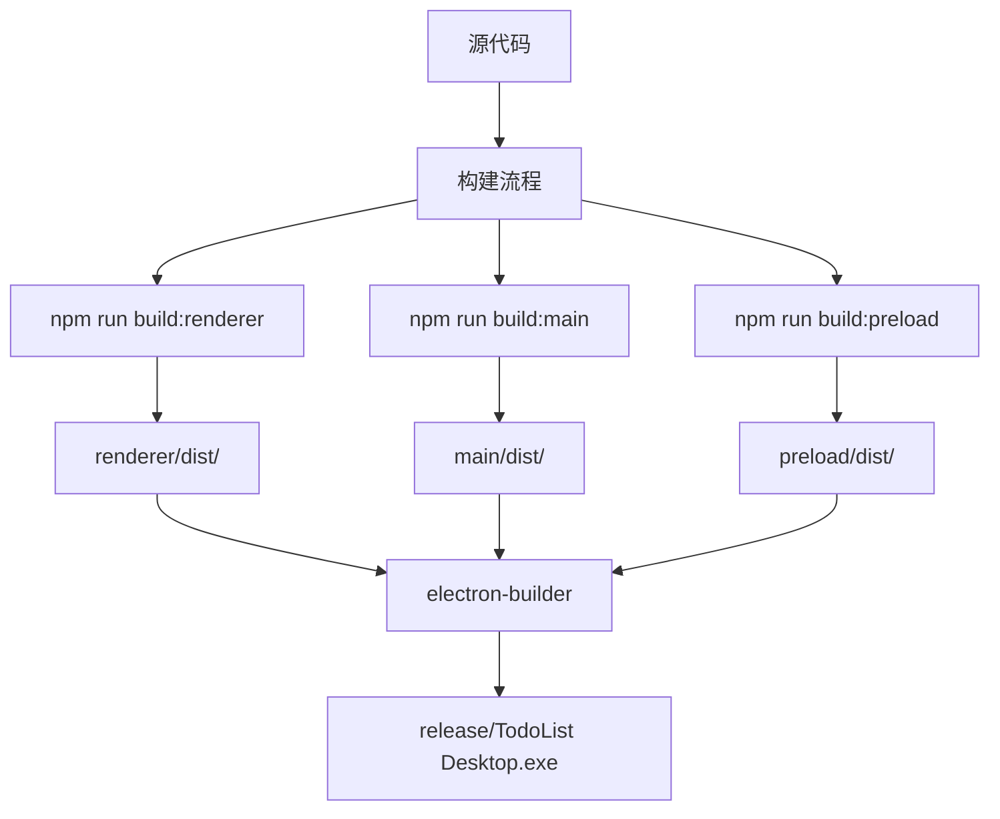

## 用户需求

将 TodoListDesktop  Electron 应用打包成 Windows 便携版/绿色版免安装软件

## 功能说明

- 生成单个可执行文件 (.exe)，无需安装即可运行
- 应用程序数据保存在可执行文件同目录或用户数据目录
- 支持即插即用，可在 U 盘等移动存储设备上运行
- 保持现有应用功能完整性（数据库、文件导出等）

## 视觉要求

- 保持现有应用界面不变
- 打包后的可执行文件使用项目图标

## 技术方案

使用 electron-builder 的 portable 目标进行打包

## 技术栈

- **打包工具**: electron-builder v24.9.1
- **打包目标**: Windows portable (单个 .exe 文件)
- **构建流程**: Vite 构建前端 → TypeScript 编译 → electron-builder 打包

## 实现方法

### 核心策略

修改 package.json 中的 electron-builder 配置，将 Windows 打包目标从 "nsis" 改为 "portable"

### 配置说明

- **portable 模式**: 生成单个 .exe 文件，无需安装
- **数据持久化**: 使用 electron-store 自动保存到应用数据目录
- **图标配置**: 使用现有的 icon.ico 文件

### 打包流程

1. 构建 Vite 前端资源 (renderer/dist)
2. 编译 TypeScript 代码 (main/dist, preload/dist)
3. electron-builder 打包为 portable .exe

## 架构设计



## 目录结构

```
e:/AZE-BlackCore/TodoListDesktop/
├── package.json              # [MODIFY] 添加 portable 打包配置
├── main/
│   └── dist/                 # [EXISTING] 主进程编译输出
├── preload/
│   └── dist/                 # [EXISTING] 预加载脚本编译输出
├── renderer/
│   └── dist/                 # [EXISTING] 渲染器构建输出
└── release/                  # [EXISTING] 打包输出目录
    └── TodoList Desktop.exe  # [NEW] 生成的便携版可执行文件
```

## 执行细节

### 构建命令

- **完整构建**: `npm run electron:build` - 自动执行所有构建步骤并打包
- **仅打包**: `npm run electron:pack` - 打包为未签名目录（测试用）

### 注意事项

1. 确保图标文件 `renderer/public/icon.ico` 存在
2. portable 版本会生成单个 .exe 文件在 release 目录
3. 应用数据通过 electron-store 自动管理，保存在用户数据目录
4. 打包前确保所有依赖已安装 (node_modules)

### 性能优化

- 构建过程并行执行，减少等待时间
- portable 模式无需解压安装，启动速度更快