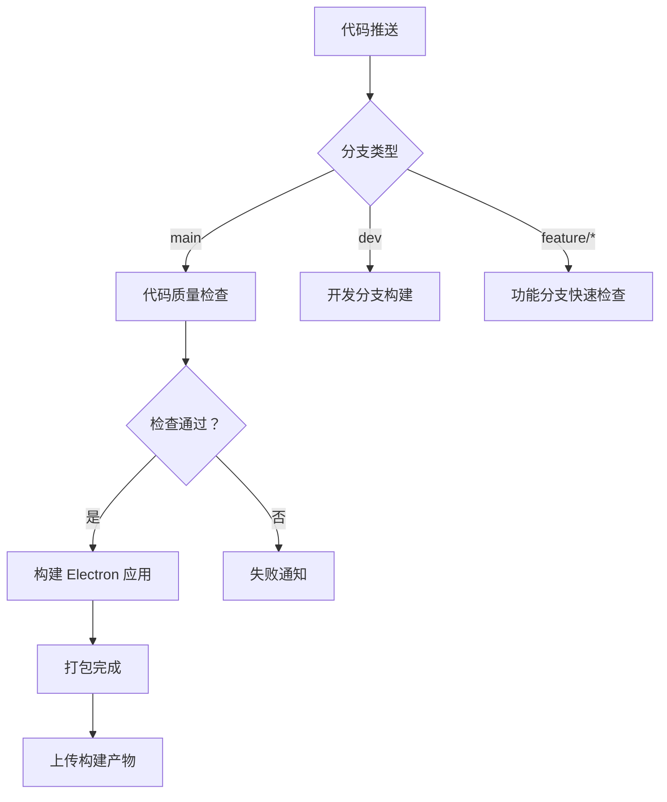

# CNB 流水线构建文档

本文档说明如何在 CNB（云原生构建）平台上配置和使用 TodoList Desktop 项目的自动化构建流水线。

## 📖 目录

- [概述](#概述)
- [流水线架构](#流水线架构)
- [配置说明](#配置说明)
- [环境变量](#环境变量)
- [使用指南](#使用指南)
- [故障排查](#故障排查)

---

## 概述

TodoList Desktop 项目使用 CNB 平台实现持续集成和持续部署（CI/CD）。流水线配置基于 `.cnb.yml` 文件，支持多分支策略、自动化测试、代码质量检查和 Electron 应用构建。

### 核心功能

- ✅ **自动化代码检查**：TypeScript 类型检查、ESLint 代码规范检查
- ✅ **自动化测试**：单元测试和集成测试
- ✅ **Electron 构建**：自动打包 Windows 可执行文件
- ✅ **多分支策略**：针对不同分支采用不同的构建策略
- ✅ **PR 检查**：Pull Request 自动代码审查
- ✅ **发布管理**：Tag 推送时自动创建 Release

---

## 流水线架构

### 层级结构

```
触发分支 (main/dev/feature/*)
  └─ 触发事件 (push/pull_request/tag_push)
      └─ Pipeline (流水线)
          └─ Stage（阶段）
              └─ Job（任务）
                  └─ Script/Plugin（脚本/插件）
```

### 执行流程



---

## 配置说明

### 主分支流水线 (main)

**触发条件**：代码推送到 main 分支

**包含两个并行流水线**：

#### 1. 代码质量检查

```yaml
name: 📊 代码质量检查
runner:
  tags: []  # 使用默认 Runner，避免标签不匹配
  cpus: 2
docker:
  image: node:20
```

**注意**：如果遇到 `No runner for namespace` 错误，请确保：
- 使用 `tags: []` 允许使用任意可用 Runner
- 或查看平台可用 Runner：`cnb runner list --namespace global`
- 参考文档：https://docs.cnb.cool/build/build-node.html

**执行步骤**：
1. 📦 安装依赖 - `npm ci`
2. 🔍 类型检查 - `npm run typecheck:all`
3. ✨ ESLint 检查 - `npm run lint`
4. 🧪 运行测试 - `npm run test`

**优化策略**：
- 使用 `ifModify` 仅在相关文件变更时执行
- 配置 `node_modules` 缓存加速构建
- 失败时执行 `failStages` 通知

#### 2. Electron 应用构建

```yaml
name: 🏗️ 构建 Electron 应用
runner:
  tags: []  # 使用默认 Runner
  cpus: 4
```

**执行步骤**：
1. 📦 安装依赖
2. 🔨 编译主进程 - `npm run build:main`
3. 🔨 编译预加载脚本 - `npm run build:preload`
4. 🎨 构建渲染进程 - `npm run build:renderer`
5. 📱 打包 Electron 应用 - `npm run electron:build`
6. 📤 上传构建产物

**特性**：
- 支持失败重试（retry: 2）
- 配置 `endStages` 构建完成通知
- 使用数据卷缓存构建产物

### 开发分支流水线 (dev)

**触发条件**：代码推送到 dev 分支

**特点**：
- ✅ 允许失败（`allowFailure: true`）
- ✅ 快速反馈构建状态
- ✅ 包含完整的构建检查

### 功能分支流水线 (feature/*)

**触发条件**：代码推送到 feature/* 分支

**特点**：
- ✅ 仅检查关键项目（`ifModify`）
- ✅ 新分支首次提交时执行（`ifNewBranch: true`）
- ✅ 快速类型检查和 ESLint 检查

### Pull Request 检查

**触发条件**：创建或更新 Pull Request

**配置**：
```yaml
lock:
  enable: true
  group: pr-check
```

**作用**：防止并发 PR 检查，确保资源合理使用

### Tag 发布流水线

**触发条件**：推送 Tag（如 v1.1.0）

**执行内容**：
1. 完整构建 Electron 应用
2. 生成版本信息
3. 准备 GitHub Release

---

## 环境变量

### 内置环境变量

CNB 平台自动提供的环境变量：

| 变量名 | 说明 | 示例 |
|--------|------|------|
| `CNB_COMMIT_SHA` | 提交 SHA | `a31c45c7...` |
| `CNB_BRANCH` | 分支名称 | `main` |
| `CNB_TAG_NAME` | Tag 名称 | `v1.1.0` |
| `CNB_PIPELINE_NAME` | 流水线名称 | `构建 Electron 应用` |

### 自定义环境变量

在 `.cnb.yml` 中配置：

```yaml
env:
  NODE_ENV: production
  CI: "true"
  GH_TOKEN: ${GH_TOKEN}  # 从密钥仓库导入
```

### 密钥管理

**推荐做法**：使用密钥仓库管理敏感信息

1. 创建密钥仓库：`AZE-BlackCore/secrets`
2. 创建 `env.yml` 文件：
```yaml
version: v1
secrets:
  GH_TOKEN: "github_pat_xxx"
  NPM_TOKEN: "npm_xxx"
```
3. 在主仓库 `.cnb.yml` 中导入：
```yaml
imports:
  - https://cnb.cool/AZE-BlackCore/secrets/-/raw/main/env.yml
```

---

## 使用指南

### 首次配置

1. **连接 CNB 仓库**
   - 访问 https://cnb.cool/AZE-BlackCore/TodoList
   - 在设置中启用 CNB 构建

2. **配置构建节点**
   - 选择 `ubuntu-latest` 节点
   - 配置 CPU 和内存资源

3. **验证配置**
   - 推送代码到任意分支
   - 查看流水线执行状态

### 日常开发

#### 功能分支开发

```bash
# 创建功能分支
git checkout -b feature/new-feature

# 开发并提交
git add .
git commit -m "feat: 添加新功能"
git push origin feature/new-feature
```

**自动触发**：
- ✅ 快速代码检查
- ✅ TypeScript 类型检查
- ✅ ESLint 规范检查

#### 提交到开发分支

```bash
git checkout dev
git merge feature/new-feature
git push origin dev
```

**自动触发**：
- ✅ 完整构建检查
- ✅ 所有测试用例
- ✅ Electron 构建验证

#### 发布新版本

```bash
# 切换到主分支
git checkout main
git pull

# 创建版本标签
git tag -a v1.1.0 -m "Release v1.1.0"
git push origin v1.1.0
```

**自动触发**：
- ✅ 完整构建流程
- ✅ 生成版本信息
- ✅ 准备 Release 发布

### 查看构建状态

1. **访问构建页面**
   - https://cnb.cool/AZE-BlackCore/TodoList/pipelines

2. **查看构建日志**
   - 点击流水线名称
   - 查看每个 Stage 的详细输出

3. **下载构建产物**
   - 构建成功后在 `release/` 目录
   - 或通过 CNB 的制品管理下载

---

## 故障排查

### 常见问题

#### 0. Runner 分配失败

**症状**：
```
Pipeline prepare error: No runner for namespace: global tags: [ubuntu-latest, cpus:4]
```

**原因**：
- 指定的 Runner 标签在当前命名空间下不可用
- CNB 平台的 Runner 标签配置与流水线配置不匹配

**解决方案**：
```yaml
# 方法 1：使用默认 Runner（推荐）
runner:
  tags: []  # 清空标签限制
  cpus: 4   # 保留资源控制

# 方法 2：查看平台可用 Runner
# cnb runner list --namespace global

# 方法 3：使用平台实际支持的标签
runner:
  tags:
    - cnb:arch:default
    - ubuntu-22.04  # 替换为实际支持的标签
  cpus: 4
```

**参考文档**：
- Runner 管理：https://docs.cnb.cool/build/build-node.html
- 标签配置：https://docs.cnb.cool/zh/build/grammar.html#pipeline-runner

#### 1. 构建失败：依赖安装超时

**症状**：
```
npm ERR! network timeout at: https://registry.npmjs.org/
```

**解决方案**：
```yaml
# 使用国内镜像
docker:
  image: node:20
env:
  NPM_CONFIG_REGISTRY: https://registry.npmmirror.com
script: |
  npm ci --registry=https://registry.npmmirror.com
```

#### 2. 构建失败：内存不足

**症状**：
```
<--- Last few GCs --->
FATAL ERROR: Ineffective mark-compacts near heap limit
```

**解决方案**：
```yaml
# 增加构建节点资源
runner:
  tags: ubuntu-latest
  cpus: 4
  # 如果支持，配置更多内存
```

#### 3. ESLint 检查失败

**症状**：
```
✖ 6 problems (6 errors, 0 warnings)
```

**解决方案**：
```bash
# 本地修复
npm run lint -- --fix

# 或手动修复错误后重新提交
```

#### 4. TypeScript 类型错误

**症状**：
```
error TS2345: Argument of type 'X' is not assignable to parameter of type 'Y'
```

**解决方案**：
```bash
# 本地运行类型检查
npm run typecheck:all

# 修复类型错误后重新提交
```

#### 5. Electron 构建失败

**症状**：
```
Error: Cannot find module 'xxx'
```

**解决方案**：
```yaml
# 确保所有依赖都已安装
script: |
  npm ci
  npm run build:main
  npm run build:preload
  npm run build:renderer
  npm run electron:build
```

### 查看构建日志

```bash
# 在 CNB 控制台查看
1. 进入流水线页面
2. 点击最近的构建记录
3. 展开失败的 Stage
4. 查看详细错误信息
```

### 本地复现构建

```bash
# 完全清理后重新构建
rm -rf node_modules main/dist preload/dist renderer/dist release
npm ci
npm run typecheck:all
npm run lint
npm run test
npm run electron:build
```

### 联系支持

如遇到无法解决的问题：
- 📧 查看 CNB 文档：https://docs.cnb.cool/
- 💬 提交 Issue：https://github.com/AZE-BlackCore/TodoList/issues
- 📝 查看构建历史：https://cnb.cool/AZE-BlackCore/TodoList/pipelines

---

## 最佳实践

### 1. 提交信息规范

使用 Conventional Commits 规范：
```
feat: 添加新功能
fix: 修复 bug
docs: 文档更新
style: 代码格式调整
refactor: 重构代码
test: 测试相关
chore: 构建/工具链相关
```

### 2. 分支管理策略

- `main`：生产分支，仅允许合并已验证的代码
- `dev`：开发分支，日常开发合并到此分支
- `feature/*`：功能分支，开发新功能
- `release/*`：发布分支，准备新版本

### 3. 代码审查流程

1. 在功能分支开发
2. 提交 Pull Request 到 dev 分支
3. 等待 CNB 自动检查通过
4. 代码审查通过
5. 合并到 dev 分支
6. 测试稳定后合并到 main 分支

### 4. 版本发布流程

1. 在 dev 分支完成所有功能
2. 创建 release 分支进行最终测试
3. 更新版本号（package.json）
4. 创建 Tag 并推送到 main 分支
5. CNB 自动构建并发布

### 5. 性能优化

- ✅ 使用 `node_modules` 缓存
- ✅ 使用 `ifModify` 减少不必要的构建
- ✅ 并行执行独立任务
- ✅ 合理配置构建节点资源

---

## 更新日志

### v1.0.0 (2026-04-02)
- ✨ 初始 CNB 流水线配置
- ✅ 支持多分支构建策略
- ✅ 代码质量检查自动化
- ✅ Electron 应用构建自动化
- ✅ PR 自动检查
- ✅ Tag 发布流程

---

**文档维护**：AZE-BlackCore 团队  
**最后更新**：2026-04-02  
**CNB 配置版本**：v1.0.0
